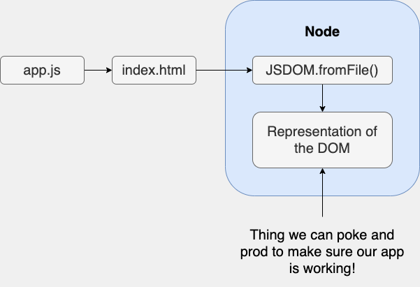

## About The Project

- The Modern Javascript Bootcamp Course (2022)
- The most up-to-date JS resource online! Master Javascript by building a beautiful portfolio of projects!
- Tutorial for tme (Building a Testing Framework From Scratch)
- [Colt Steele](https://github.com/Colt)
- [Stephen Grider](https://github.com/StephenGrider)

&nbsp;

## Notes

- Command to search for <code>.test.js</code> from any directory.

```sh
tme
```

- [global variable in browser & Node.js](https://nodejs.org/api/globals.html#globals_global)

### Testing Framework Requirements

1. Must be a Node-based CLI framework
2. Must be able to test browser-based JS apps
3. Must require very, very little setup
4. Must be able to test a whole application, not just one little widget
5. CLI must have a 'watch mode' so we don't have to keep restarting it over and over
6. CLI must automatically find and run all files in our project that have a name of '\*.test.js'



<style>table,th,td {text-align: center; width: 500px}</style>

---

<table>
  <thead>
    <tr>
      <th colspan="2">Mocha in the Browser</th>
    </tr>
  </thead>
  <tbody>
    <tr>
      <td>createAutoComplete</td>
      <td>Email Validation</td>
    </tr>
    <tr>
      <td>We had a function to run as manay times as we wanted</td>
      <td>Form logic executes instantly with 'index.js' being loaded</td>
    </tr>
    <tr>
      <td>We could create a new autocomplete for each test</td>
      <td>No easy ability to bind to a second form</td>
    </tr>
    <tr>
      <td>Direct handle onto the function we want to test</td>
      <td>Effectively, can only run one test</td>
    </tr>
  </tbody>
</table>

### Implementation Plan

1. File Collection
   - Find all files ending in '\*test.js' recursively through a folder
   - Store a reference to each file we find
   - After getting a full list of the rest files, execute them one by one
2. Test environment setup
3. Test file execution
4. Report results

&nbsp;

### Notes taken from An Incorrectly Passing Test comment section:

> <b>Alireza: </b> Adding async await to it function definition

> At 4:10 we add async and await keywords to the function definition of global.it so that node waits for DOM to fully load before testing it. This seems to break the reporting if our tests do not require asynchronous operation - for example if we run the tme command on the sampleproject folder with forEach.test.js and forEachCopy.test.js.

> See the report below:

> Before Adding async - await

```js
---- test/forEach.test.js
        OK - should sum an array
        OK - beforeEach is ran each time
---- test/forEachCopy.test.js
        OK - should sum an arrays
        OK - beforeEach is ran each times
```

> After adding async await

```js
---- test/forEach.test.js
---- test/forEachCopy.test.js
        OK - should sum an array
        OK - beforeEach is ran each time
        OK - should sum an arrays
        OK - beforeEach is ran each times
```

> Is there a way to rectify the reporting issue?

> <b>Stephen: </b>Great catch, I did not see this previously. We could fix this by storing a reference to each 'it' function then invoking them all in a row. Fixed code:

```js
async runTests() {
    for (let file of this.testFiles) {
      console.log(chalk.gray(`---- ${file.shortName}`));
      const beforeEaches = [];
      const its = [];

      global.render = render;
      global.beforeEach = fn => {
        beforeEaches.push(fn);
      };
      global.it = async (desc, fn) => {
        its.push({ desc, fn });
      };

      try {
        require(file.name);
        for (let _it of its) {
          const { desc, fn } = _it;
          for (let _before of beforeEaches) {
            _before();
          }
          try {
            await fn();
            console.log(chalk.green(`\tOK - ${desc}`));
          } catch (err) {
            const message = err.message.replace(/\n/g, '\n\t\t');
            console.log(chalk.red(`\tX - ${desc}`));
            console.log(chalk.red('\t', message));
          }
        }
      } catch (err) {
        console.log(chalk.red(err));
      }
    }
  }
```

> <b>Alireza: </b>Nice one - It's quite a change then to fix this issue. So, we need to implement a queuing system with arrays to make sure tests and console logs are executed in order. One last question - Does <code>global.it</code> function definition need to be <code>async</code>?

```js
global.it = async (desc, fn) => {
  its.push({ desc, fn });
};
```

I don't see any <code>await</code> keywords within its definition now.

> <b>Stephen: </b>You're correct, the 'async' keyword could be dropped with that rewrite Yes, the system gets a bit more complicated by adding in the 'it' queue. However - trust me - this is still a lot simpler than what other testing libraries like Mocha do :)

> <b>Alireza: </b>Awesome! Oh yes this is by far way better than Jasmine and Mocha! I think I will try to re-write tme in Python too for my data science applications! I'll post a link to my repo when I do. Thanks for showing us how to create this framework - this is super useful.

> One thing I still haven't understood from these testing libs are concepts like spies and hooks, etc. Do you think you can create/extend the course in the future to implement our own spies and hooks? Amazing course and project section again! Thanks a lot Stephen.

> <b>Stephen: </b>Spy implementations can be really straightforward, here's a sample:

```js
module.exports = class Spy {
  constructor(target, key) {
    this.target = target;
    this.key = key;
    this.calls = [];

    this._func = target[key];
    target[key] = (...args) => this.exec(...args);
  }

  exec(args) {
    this.calls.push(args);
  }

  reset() {
    this.target[this.key] = this._func;
  }
};
```

> You can modify the 'exec' function to also 'call through' to the original method. This one just stores the provided arguments.

> To use this in the TME project, add in the following to the runner.js file:

```js
const Spy = require('./spy');
global.Spy = Spy;
That assumes you created the spy in a 'spy.js' file.
```

> Finally, to use it in a test:

```js
const assert = require('assert');

class Counter {
  constructor() {
    this.count = 0;
  }

  add(value) {
    for (let i = 0; i < value; i++) {
      this.incrementByOne();
    }
  }

  incrementByOne() {
    this.count++;
  }
}

it('can add many values at once', () => {
  const counter = new Counter();
  const spy = new Spy(counter, 'incrementByOne');

  counter.add(10);

  assert.equal(spy.calls.length, 10);
});
```

&nbsp;
